# Trigger Happy

A lightweight macOS menu-bar utility for global hotkeys, app launching, clipboard history, and a keyboard cheat sheet — with an optional **BBS / PCBoard terminal** look for its overlays.

Runs as a menu-bar app (no Dock icon), non-sandboxed, on **macOS 14.0+**.

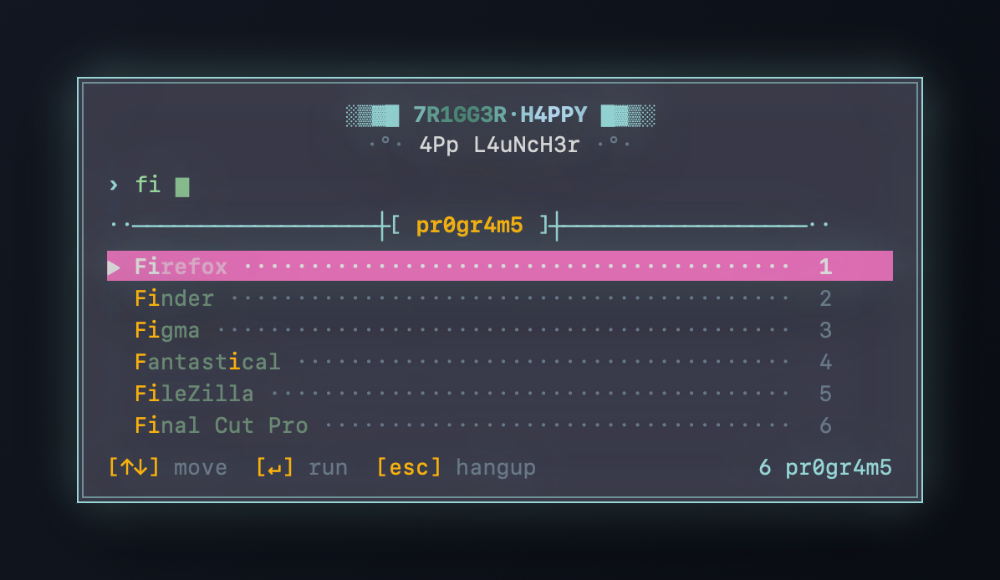

## Features

- **Custom hotkeys** — bind any key combination to launch an app (e.g. `⌃⇧F` → Firefox). Registered via Carbon `RegisterEventHotKey`, so **no Accessibility/Input Monitoring permission** is needed.
- **App Launcher** (`⌥Space`) — fuzzy-search and launch any installed app.
- **Clipboard History** (`⌥V`) — searchable history with pinned/saved clips; paste on Enter.
- **Cheat Sheet** (`⌥/`) — a reference card of all your configured hotkeys.
- **Two overlay themes** (Settings → Overlay Theme):
  - **Modern** — frosted, native SwiftUI panels.
  - **BBS** — a 90s ANSI/PCBoard terminal aesthetic (CP437 double-line borders, monospaced grid, l33t/StUdLy chrome text, white-on-magenta "lightbar" selection, animated banner wordmark).

### BBS theme options

When the BBS theme is active, additional settings appear:

- **Color Scheme** — 15 palettes: five originals (Classic, Midnight, Amber, Green, Synthwave) and ten ported from popular editor themes (**Dracula, Nord, Solarized, Tokyo Night, Gruvbox, One Dark, Monokai, Catppuccin, GitHub Dark, Rosé Pine**). One knob reskins every overlay; selection-bar text auto-picks light/dark for legibility.
- **BBS Banner** — the animated header wordmark: **Theme** (tracks the scheme's main color), **Rainbow** (full spectrum), or a fixed color (Cyan/Magenta/Amber/Green/Blue/Coral) shimmer.
- **Launcher Layout** — **Center** (a centered popup) or **Quake** (a full-width, one-line console that folds down from the top of the screen; query on the left, results listed horizontally).

## Screenshots

> Previews rendered from the app's real SwiftUI views with sample data.

### Modern theme

Frosted native panels that follow the system's light or dark appearance — App Launcher, Clipboard History, and Cheat Sheet:

| Light | Dark |
|:---:|:---:|
| 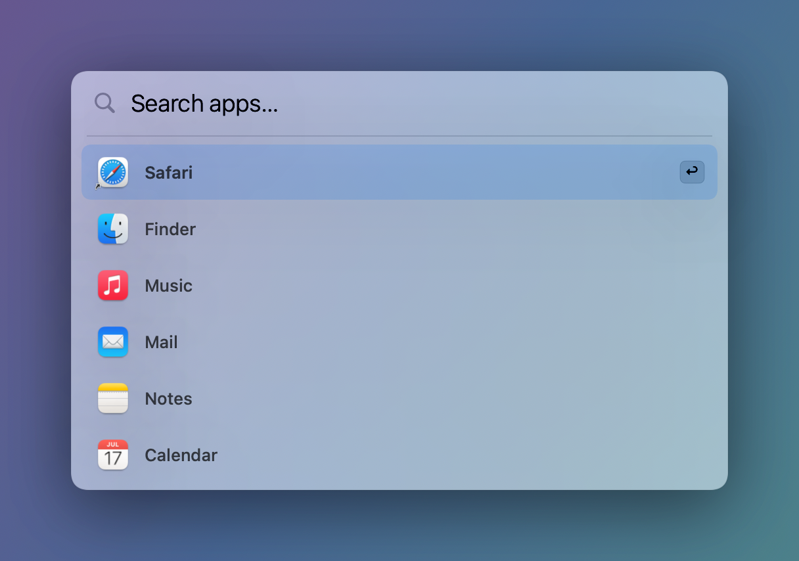 | 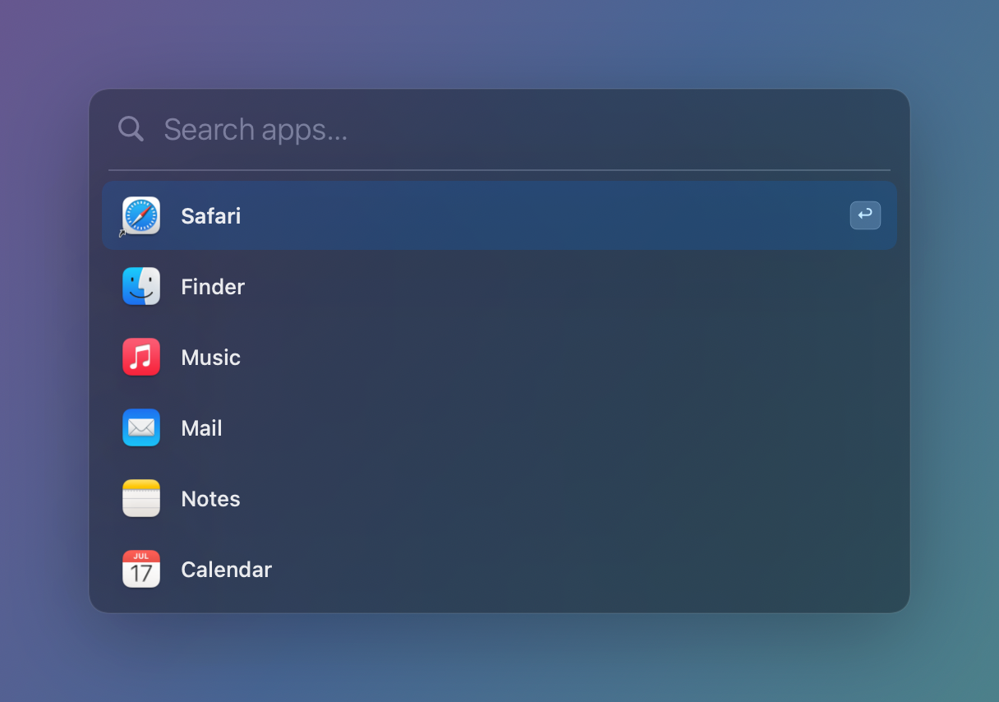 |
| 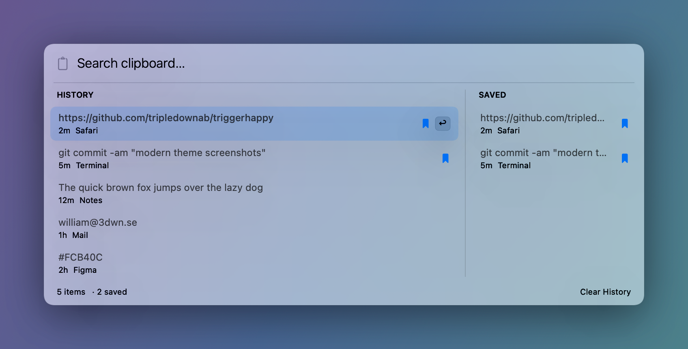 | 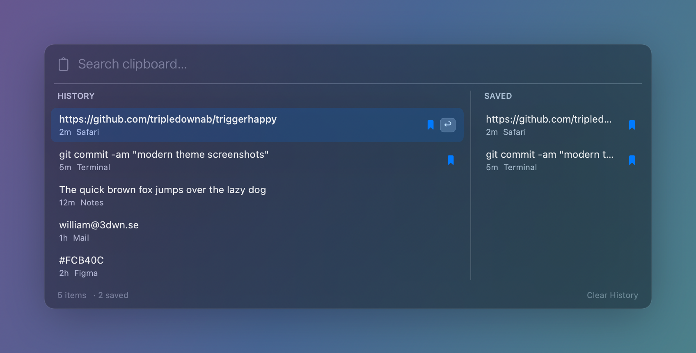 |
| 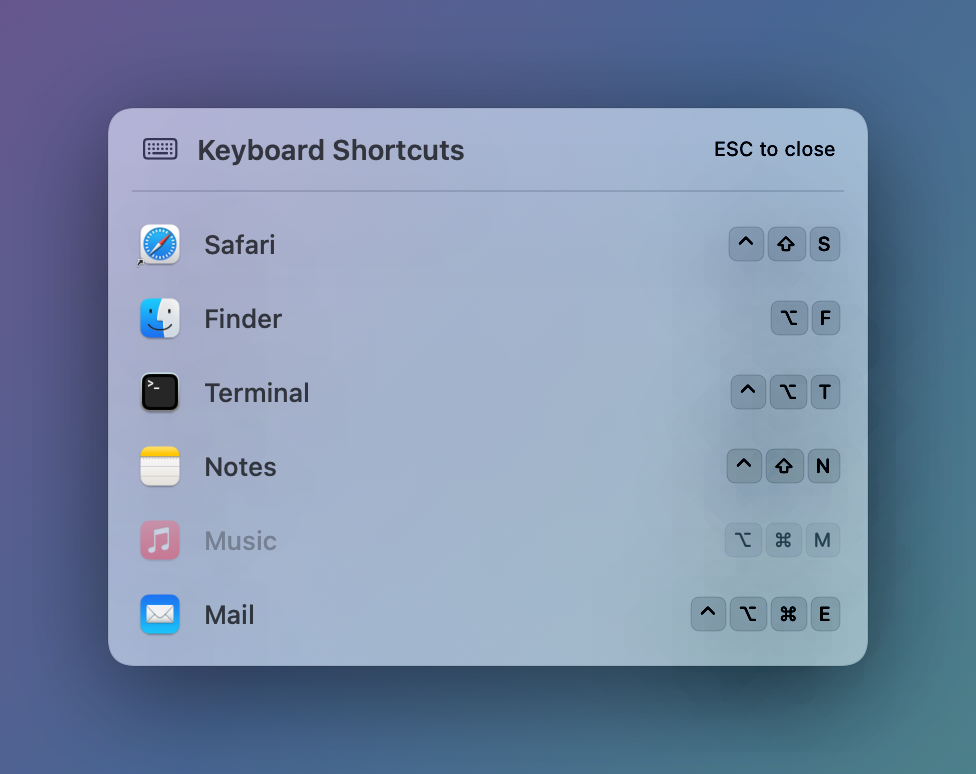 | 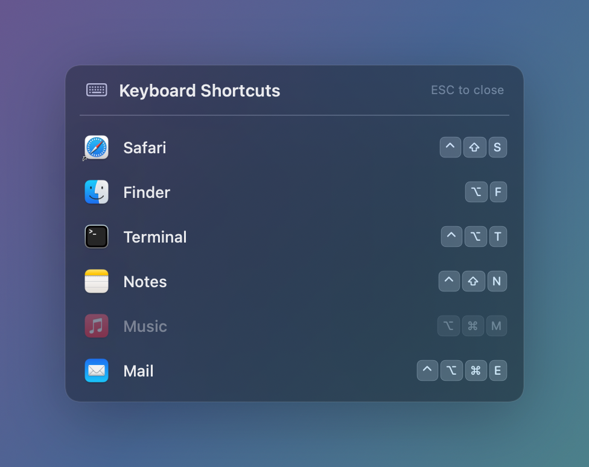 |

### BBS theme

**Quake drop-down launcher** — full-width, folds down from the top, results listed horizontally (matched query characters highlighted):

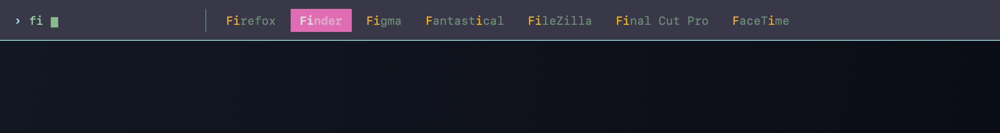

**Clipboard History** — searchable, with pinned/saved clips and a CP437 scrollbar:

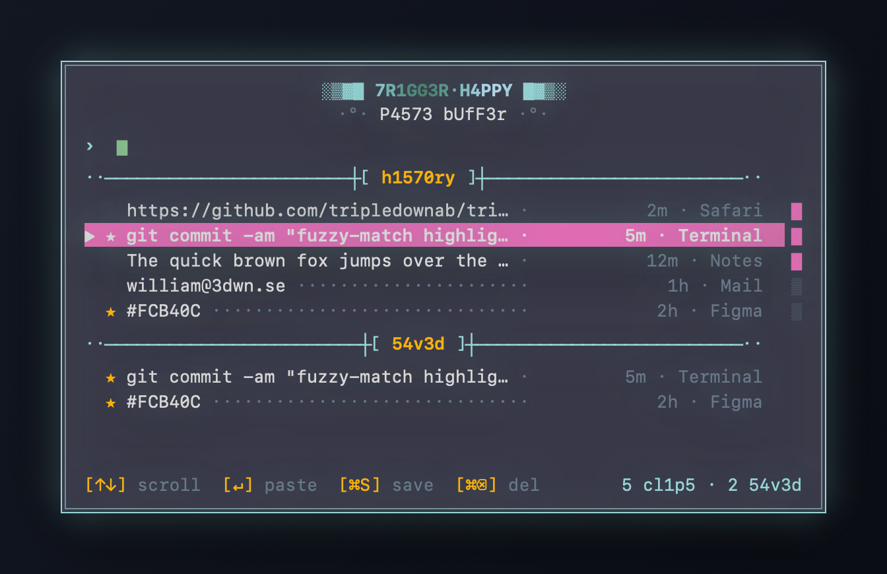

**Cheat Sheet** — all your configured hotkeys at a glance:

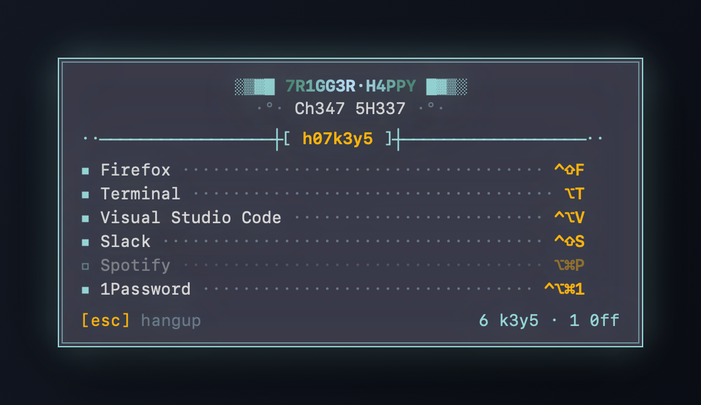

**Color schemes** — one knob reskins every overlay (15 palettes, incl. popular editor themes):

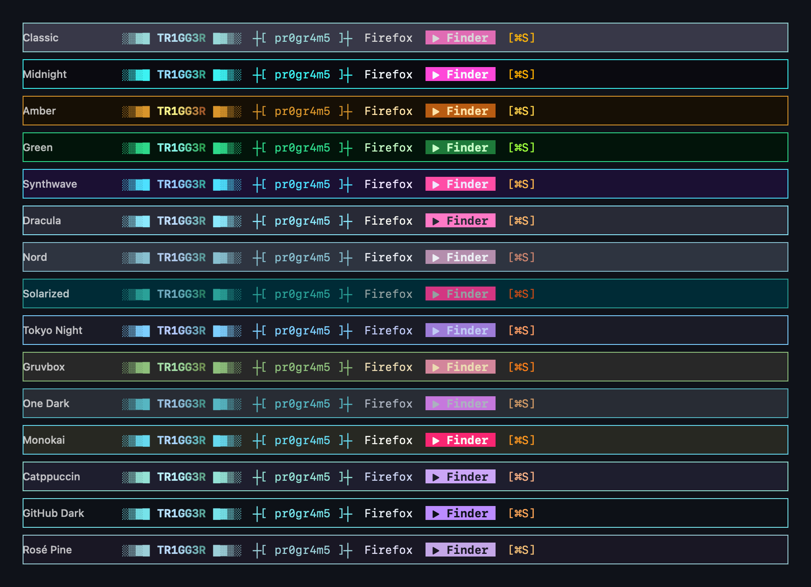

## Default hotkeys

| Action | Shortcut |
|--------|----------|
| App Launcher | `⌥Space` |
| Clipboard History | `⌥V` |
| Cheat Sheet | `⌥/` |

All three are configurable in Settings, alongside your custom app-launch bindings.

## Build & Run

Pure Xcode project — no SPM, no CocoaPods. A `Makefile` wraps the usual steps:

```bash
make build      # compile (xcodebuild under the hood)
make install    # build, copy TriggerHappy.app to the project root, and launch it
make run        # relaunch the copied app
make clean      # remove build products
```

Or drive `xcodebuild` directly:

```bash
xcodebuild -project TriggerHappy.xcodeproj -scheme TriggerHappy -configuration Debug build
cp -R ~/Library/Developer/Xcode/DerivedData/TriggerHappy-*/Build/Products/Debug/TriggerHappy.app ./TriggerHappy.app
open ./TriggerHappy.app
```

## Architecture

See [CLAUDE.md](CLAUDE.md) for a detailed tour. In brief:

- **Dual hotkey pipelines** — user bindings (`HotkeyManager` + `BindingStore`) and built-in system hotkeys (`AppDelegate`), both on Carbon.
- **Floating panels** — App Launcher, Clipboard, and Cheat Sheet each host a SwiftUI view in a borderless `KeyablePanel`, positioned on the screen under the cursor.
- **Theme system** — `BBS` resolves its palette through the selected `BBSScheme`; the overlays branch on `LauncherTheme` (modern/bbs) and, for the launcher, `LauncherLayout` (center/quake). All preferences persist to `UserDefaults`.

## Credits

The BBS/ANSI aesthetic is inspired by [Cathode](https://github.com/tripledownab/cathode), a sister TUI harness for Claude Code — same CP437 palette, animated rainbow wordmark, and lightbar conventions.

## License

_TODO: add a license._
